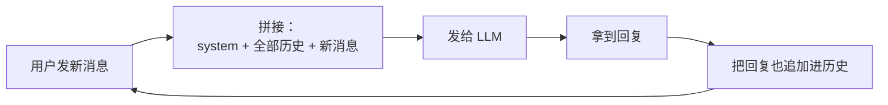
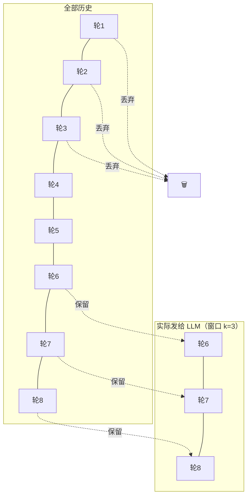

# 01 · 起点：从全量拼接到滑动窗口

> 本章从"零上下文工程"的最朴素 chatbot 出发，推导出第一个不得不做的优化——滑动窗口，并发现它致命的"失忆"问题。

---

## 1.1 最朴素的方案：把所有历史原样拼上去

你要做一个聊天机器人。大模型 API（比如 DeepSeek、Qwen）长这样：

```python
response = llm.chat(messages=[
    {"role": "system",    "content": "你是一个helpful助手"},
    {"role": "user",      "content": "你好"},
    {"role": "assistant", "content": "你好！有什么可以帮你的？"},
    {"role": "user",      "content": "我叫小明"},          # ← 新消息
])
```

大模型 API 是**无状态**的——它不记得你上一次问了什么。所以**多轮对话的唯一办法**，就是每次请求都把**完整历史**重新发一遍。这就是最朴素的方案：



代码上就是一个不断变长的数组：

```python
history = []
def chat(user_input):
    history.append({"role": "user", "content": user_input})
    reply = llm.chat(messages=[SYSTEM] + history)   # 每次都发全部
    history.append({"role": "assistant", "content": reply})
    return reply
```

**这个方案能跑**。短对话完全没问题。本项目最早期的 `ChatService.chat_stream` 就是这个思路（见 `内部工程手册` §1（项目内部工程参考手册 `analysis-for-backend/context-engine.md`））：

```
前端 messages[] → history_messages[:-1] + user_query → llm.astream(messages)
```

---

## 1.2 痛点：token 会爆

大模型的便利贴（上下文窗口）是有上限的。即使是 DeepSeek 的 128K token，也撑不住无限增长：

```
  token 用量
    ▲
128K┤                                          ╱ ← 撞墙！API 报错
    │                                      ╱
    │                                  ╱
    │                              ╱
    │                          ╱
    │                      ╱
    │                  ╱
    │              ╱  ← 对话每多一轮，全量历史就长一截
    │          ╱
    │      ╱
    │  ╱
    └──┴────┴────┴────┴────┴────┴────┴────┴──▶ 对话轮数
       10   30   50   80  120  160  200
```

而且不只是"会报错"这么简单，还有三个隐藏成本：

| 问题 | 说明 |
|---|---|
| **钱** | API 按 token 收费。第 200 轮时，你为前 199 轮的历史**反复付费**——同样的内容发了 200 遍 |
| **慢** | prompt 越长，首 token 延迟越高 |
| **笨** | 研究表明 LLM 有 "lost in the middle" 现象——上下文太长时，中间部分的信息会被忽略，effective 注意力下降 |

> 💡 **关键认知**：上下文不是"越多越好"。塞太多 = 又贵又慢又笨。上下文工程的本质是**在有限预算内，放最该放的东西**。

---

## 1.3 第一个优化：滑动窗口（只留最近 k 轮）

最直接的想法：**别全发，只发最近几轮**。

灵感来源其实很朴素——人类对话也是这样：你不会记得三个月前某次闲聊的每一句话，但你记得**刚才说了什么**。最近的上下文相关性最高。

这就是**滑动窗口（Sliding Window）**：维护一个固定大小 `k` 的窗口，只保留最近 `k` 轮对话，更早的直接丢弃。

```
对话进行到第 8 轮，窗口大小 k=3：

  轮次:  1   2   3   4   5    [6    7    8]
        ███ ███ ███ ███ ███   ▓▓▓  ▓▓▓  ▓▓▓
         ↑___________________↑   ↑___________↑
            被丢弃（看不见）        窗口内（发给 LLM）
```



代码上就是个切片：

```python
def chat(user_input, k=3):
    history.append({"role": "user", "content": user_input})
    window = history[-(2*k):]          # 最近 k 轮 = 2k 条消息(user+assistant)
    reply = llm.chat(messages=[SYSTEM] + window)
    history.append({"role": "assistant", "content": reply})
    return reply
```

### 改进效果

```
  token 用量
    ▲
128K┤
    │
    │
    │
    │     ┌─────────────────────────────  ← 封顶！稳定在窗口大小
    │    ╱
    │   ╱← 头几轮还在涨
    │  ╱
    │ ╱
    └─┴────────────────────────────────▶ 对话轮数
```

token 用量**封顶**了，无论聊多少轮都稳定。又快、又省钱、又不会撞墙。

> 📌 **本项目的体现**：这个"只保留最近 N 轮"的思想，最终演化成了 Context Engine 里的 **`RecentBufferCondenser`**（`backend/app/services/condenser.py`），默认 `max_recent_turns=5`。注意它保留的是"最近 5 轮原文"——这正是滑动窗口的直系后代。我们会在第 2 章看到它如何和摘要配合。

---

## 1.4 致命缺陷："金鱼记忆"

滑动窗口解决了 token 问题，但代价惨重。看这个真实会出问题的对话（窗口 k=3）：

```
轮1  用户: 我对花生严重过敏，记住了。
轮1  助手: 好的，我记住了你对花生过敏。
轮2  用户: 推荐个周末活动。
...（中间聊了一堆别的）...
轮7  用户: 帮我推荐一道今晚的菜谱。
轮7  助手: 推荐宫保鸡丁！配上香脆的花生粒口感更佳～  ← 💀 出事了
```

第 7 轮时，窗口只剩第 5、6、7 轮，**第 1 轮"花生过敏"已经滑出窗口、被丢弃了**。模型完全不知道这个致命约束，开开心心推荐了花生。

这就是滑动窗口的本质缺陷——我们管它叫**"金鱼记忆"**（金鱼据说只有 7 秒记忆）：

```
  记忆完整度
    ▲
100%┤████  ← 窗口内：完美记得
    │████
    │████
    │████
  0%┤████░░░░░░░░░░░░░░░░░░░░░░  ← 窗口外：彻底失忆，断崖式
    └────┬───────────────────▶ 距今轮数
       窗口边界
```

更糟的是，这种丢失是**无差别的**：

- 第 1 轮的"我叫小明"（重要！）→ 丢了
- 第 1 轮的"今天天气真好"（无所谓）→ 也丢了

滑动窗口**不区分信息的重要性**，只看"新不新"。它把一句决定生死的过敏声明，和一句无意义的寒暄，一视同仁地扔掉了。

---

## 1.5 本章遗留问题

我们陷入了一个两难：

```
        全量拼接                          滑动窗口
    ┌──────────────┐                ┌──────────────┐
    │ ✅ 记得所有事  │                │ ✅ token 封顶 │
    │ ❌ token 爆炸 │   ←───VS───→   │ ❌ 金鱼记忆   │
    └──────────────┘                └──────────────┘
            "记得全" 和 "省 token" 不可兼得？
```

有没有办法**既不爆 token，又不彻底丢失窗口外的信息**？

关键洞察来了 👇

> 窗口外的历史，我们之所以"丢弃"，是因为**原文太占地方**。
> 但如果我们不丢原文、而是把它**压缩成一小段摘要**呢？
> 一段 2000 字的对话 → 压缩成 200 字的摘要，token 省了 90%，但核心信息（比如"用户对花生过敏"）还在。

这就是下一章的主角——**滚动摘要（Rolling Summary）**。

➡️ 继续阅读：[第 02 章·记住被遗忘的：滚动摘要 Condenser](02-记住被遗忘的·滚动摘要Condenser.md)
