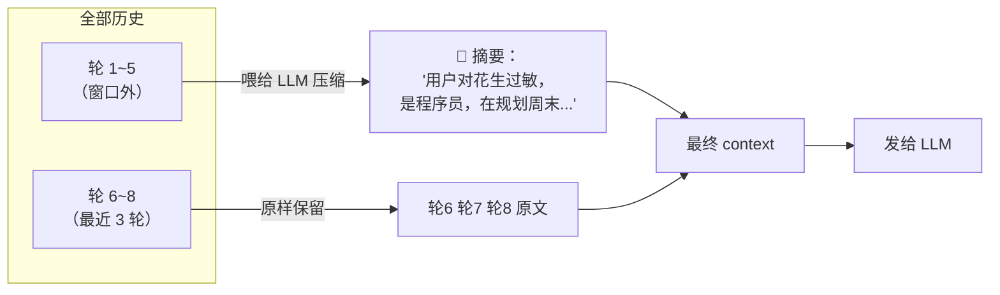
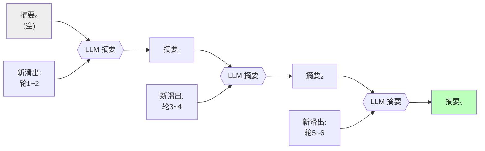
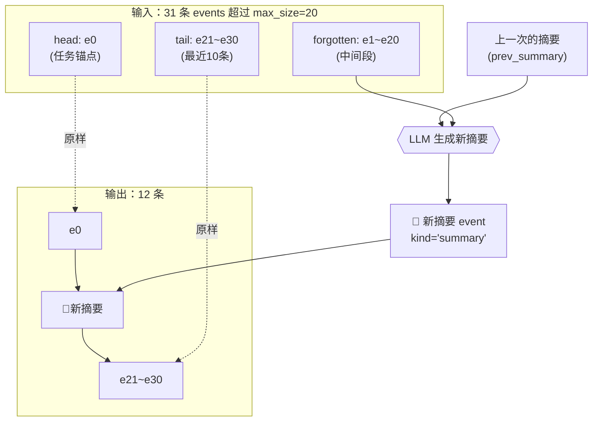
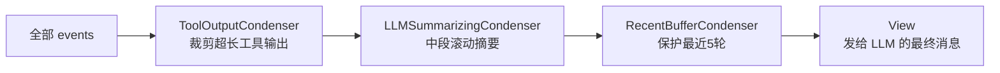

# 02 · 记住被遗忘的：滚动摘要 Condenser

> 上一章我们卡在"记得全"和"省 token"的两难。本章引入**摘要**来打破它，并一路踩坑，最终落到本项目真正使用的 **递归滚动摘要（OpenHands 算法）**。

---

## 2.1 思路：丢之前先压缩

回顾上章的洞察：窗口外的历史之所以要丢，是因为**原文占地方**。那就别丢原文，先**压缩**。

大模型本身就是世界上最强的文本压缩器——让它把一长段对话总结成几句话，是它的本职工作。于是有了第一版方案：

```
┌─────────────────────────────────────────────────┐
│  最近 k 轮：保留原文（精确、不失真）                 │
├─────────────────────────────────────────────────┤
│  更早的历史：不丢，喂给 LLM 压成一段摘要              │
└─────────────────────────────────────────────────┘
```



现在第 7 轮推荐菜谱时，context 里有这么一句摘要："**用户对花生过敏**"——模型就不会再推荐花生了。金鱼记忆被治好了，而且 token 依然可控（摘要很短）。

> 📌 **本项目的体现**：这就是 Context Engine 七层模型里的 **L3 · Rolling Summary** 层，配合 **L2 · Recent Buffer**（最近 N 轮原文）。两者一压缩一保真，是整个 Condenser 的核心骨架。

---

## 2.2 踩坑一：每轮从零摘要，又贵又会"漂移"

第一版最自然的实现：**每一轮，都把所有窗口外历史重新摘要一遍**。

```python
def build_context():
    old = history[:-2*k]          # 窗口外
    summary = llm.summarize(old)  # 每轮都重新摘要全部旧历史 ← 问题在这
    recent = history[-2*k:]
    return summary + recent
```

这有两个隐患：

### 隐患 A：成本爆炸

第 50 轮时，"窗口外历史"有 45 轮。你每轮都把这 45 轮重新喂给 LLM 做摘要——**摘要本身又变成了一次全量拼接**！我们绕了一圈，又回到了第 1 章的 token 爆炸，只不过这次爆在"摘要调用"上。

### 隐患 B：语义漂移（最隐蔽）

LLM 摘要是**有损且不确定**的。每次重新摘要，措辞都略有不同。如果每轮都从原文重新摘要，连续 50 轮下来，早期信息会像"传话游戏"一样逐渐失真：

```
轮5  摘要: "用户对花生严重过敏"
轮20 摘要: "用户对坚果过敏"           ← 花生≠坚果，已经漂了
轮40 摘要: "用户有一些食物忌口"        ← 越来越模糊
轮60 摘要: "用户饮食上有偏好"          ← 💀 关键信息蒸发了
```

每次重新生成都是一次"重新理解"的机会，而每次重新理解都可能引入偏差。**重新摘要的次数越多，漂移越严重。**

---

## 2.3 灵感：递归滚动摘要（来自 OpenHands）

怎么办？我们参考了 **OpenHands**（一个开源 AI 软件工程 agent）的 `LLMSummarizingCondenser`。它的核心洞察是：

> **不要每次都从原文重新摘要。把"上一次的摘要"也当作输入，只增量地把"新滑出窗口的那几条"并进去。**

这叫**递归滚动摘要（Recursive Rolling Summary）**。关键区别：

```
❌ 从零摘要（每次都重新理解全部原文）:
   摘要_新 = LLM( 原文[1..45] )

✅ 递归滚动（只增量并入新内容）:
   摘要_新 = LLM( 摘要_旧 + 原文[新滑出的那几条] )
```

为什么这样能同时解决成本和漂移？

| | 从零摘要 | 递归滚动 |
|---|---|---|
| **每次输入量** | 全部窗口外历史（越来越大）| 旧摘要(小) + 新增几条(小) → **恒定** |
| **成本** | O(n) 每轮，总 O(n²) | O(1) 每次，总 O(n) |
| **漂移** | 早期信息被反复重新理解 → 严重漂移 | 旧摘要作为"锚点"被原样继承，只在边缘增量 → 稳定 |

可以把它想象成**滚雪球**：雪球（摘要）滚过新的雪地（新滑出的对话），只把沿途的新雪粘上来，已经在球心的旧雪不会被重新捏一遍。



---

## 2.4 算法细节：head + prev_summary + tail

本项目把 OpenHands 的算法移植成了 `LLMSummarizingCondenser`（`backend/app/services/condenser.py`）。它的触发逻辑是：

**当未摘要的事件数超过 `max_size`（默认 20）时**，把事件切成三段：

```
events（按时间排序，假设 max_size=20）:

  [e0] [e1] [e2] ........................ [e30]
   │    └──────────── 中间段 ────────────┘ └──┬──┘
   │         (forgotten，要被压缩)           tail
  head                                    (保留原文)
 (keep_first=1，                          max_size//2 = 10 条
  永远保留第一条)
```

1. **head**：前 `keep_first`（默认 1）条——**永远保留**。为什么保第一条？因为第一条 user message 通常**锚定了整个对话的任务意图**（"帮我写个爬虫"），丢了它后面全跑偏。
2. **tail**：最后 `max_size//2`（默认 10）条——保留原文，这就是"最近窗口"。
3. **forgotten**：中间段——**喂给 LLM 压缩**，连同上一次的摘要。

输出 = `head + 新摘要 + tail`：



对应源码（`condenser.py`，已简化）：

```python
class LLMSummarizingCondenser:
    def __init__(self, max_size=20, keep_first=1, ...): ...

    async def condense(self, events, ctx):
        body = [非 summary/受保护的 events]
        if len(body) <= self.max_size:
            return events                    # 没超阈值，原样透传

        head     = body[:keep_first]          # 前 1 条：任务锚点
        tail     = body[-(max_size//2):]      # 最近 10 条：原文
        forgotten = body[keep_first:-(max_size//2)]  # 中间段：要压缩

        new_summary = await self._build_summary_event(
            forgotten=forgotten,
            prev_summary=上一次的 summary,     # ← 递归的关键
            ctx=ctx,
        )
        return head + [new_summary] + tail
```

喂给 LLM 的 prompt 长这样（`_render_prompt`，`condenser.py:368`）：

```
[前一次摘要]
用户是程序员，对花生严重过敏，正在规划周末活动...

[待摘要的对话片段]
user: 那爬虫用 requests 还是 httpx？
assistant: 推荐 httpx，支持异步...
...

请输出新的结构化摘要：
```

> 🔑 **`prev_summary` 就是"滚雪球"里的雪球本体**。它把过去所有历史的精华原样带到下一轮，LLM 只需要把新的 forgotten 段并进去。这一行 `prev_summary=...` 就是递归滚动和"从零摘要"的全部区别。

---

## 2.5 工程化：Condenser 是可组合的"纯函数管道"

本项目没有把摘要写死成一个函数，而是抽象成一个 **Condenser 协议**——任何"输入一批 events、输出一批 events"的变换都是一个 Condenser：

```python
class Condenser(Protocol):
    async def condense(self, events: list[Event], ctx) -> list[Event]: ...
```

然后用 `PipelineCondenser` 把多个串成流水线，前一个的输出是后一个的输入：

```python
pipeline = PipelineCondenser([
    ToolOutputCondenser(max_chars_per_tool=2000),   # ① 先裁剪超长工具输出
    LLMSummarizingCondenser(max_size=20),           # ② 再对中段做滚动摘要
    RecentBufferCondenser(max_recent_turns=5),       # ③ 最后保护最近 5 轮原文
])
view = await pipeline.condense(all_events, ctx)
```



这三个 Condenser 各司其职：

| Condenser | 干什么 | 用不用 LLM |
|---|---|---|
| `RecentBufferCondenser` | 丢掉太早的原文，保最近 N 轮。**但 summary/memory_flush 永远保留** | ❌ 纯确定性 |
| `LLMSummarizingCondenser` | 中段递归滚动摘要 | ✅ 调 LLM |
| `ToolOutputCondenser` | 裁剪超长工具返回（保 head+tail+错误行），原文存进 `metadata.raw_content` | 可选 |

> 💡 **为什么设计成"纯函数"？** Condenser 不直接改数据库，只接收 events、返回 events。这样它**易测**（给定输入必有确定输出）、**易组合**（随意串联）、**不依赖数据库初始化**（单测里不用连 Mongo）。本项目为 Condenser 写了 26 个单测。

---

## 2.6 改进效果：Probe 评测实测无损

第 5 章会详谈评测，这里先给结论。我们设计了 6 个 25-30 轮的真实对话场景（中途改主意、声明过敏约束、累计记账等），对比"开/关 Context Engine"：

| 配置 | 准确率 | 历史字符数 | 摘要覆盖 |
|---|---|---|---|
| `baseline_off`（全量塞，不压缩） | 100% | 1635 | — |
| `condenser_only`（开滚动摘要） | **100%** | 1635 | 平均 14.3 events |

**结论：在 25-30 轮的真实对话里，滚动摘要对答案质量是无损的**——压缩后该答对的依然全对。代价只是每次多 30-40 秒的摘要 LLM 调用延迟。

---

## 2.7 踩过的真实 bug：datetime 时区不一致

> ⚠️ 这是本项目真实修复过的 bug，写在这里防回归。

滚动摘要要按时间给 events 排序。但有个隐蔽问题：

- 从 Mongo 读出的 event，`created_at` 被 Beanie 反序列化成 **tz-naive**（无时区）
- Condenser 新生成的 summary，`created_at` 用 `datetime.now(timezone.utc)`，是 **tz-aware**（带时区）

两者在 `sorted()` 里一比较：

```
TypeError: can't compare offset-naive and offset-aware datetimes
```

整个 Condenser pipeline 抛异常 → fail-soft 静默降级回"全量拼接"。**摘要根本没生效，但日志只有一行 warning，极难发现。**

修复：在 `condenser.py` 顶部加一个 `_naive()` 归一化函数，所有排序键统一抹掉时区：

```python
def _naive(dt):
    return dt.replace(tzinfo=None) if dt and dt.tzinfo else dt

# 所有排序处：
body_sorted = sorted(body, key=lambda e: (e.turn_id, _naive(e.created_at)))
```

> 🎓 **教训**：跨"数据库读出"和"代码新建"的 datetime 一定要统一时区策略，否则会在排序/比较时炸，而且常常被 fail-soft 吞掉。

---

## 2.8 本章遗留问题

滚动摘要很美好，但它依赖一个隐含前提：

> **必须有一份可靠、完整、有序的"事件历史"作为摘要的输入。**

可现在这份历史在哪？在前端传来的 `messages[]` 数组里。这就埋了三个雷：

```
┌────────────────────────────────────────────────────┐
│  问题 1：前端说了算                                    │
│  前端如果自己做了裁剪（比如它也搞了个滑动窗口），         │
│  后端拿到的"历史"就是残缺的，摘要出来的东西也是错的。     │
├────────────────────────────────────────────────────┤
│  问题 2：摘要存哪？                                    │
│  生成的 summary 要持久化，下一轮才能当 prev_summary。   │
│  存前端？刷新就没了。存哪才是"真相源"？                  │
├────────────────────────────────────────────────────┤
│  问题 3：RAG 引用、工具调用这些"非纯文本"事件，          │
│  在 messages[] 里根本没有位置安放。                     │
└────────────────────────────────────────────────────┘
```

根本矛盾是：**上下文的"主权"在前端手里，后端只是被动接受一个 messages 数组。** 我们需要把主权夺回到服务端，建立一个后端自己掌控的、不可篡改的"历史真相源"。

这就是下一章——**Event Stream（事件溯源）**。

➡️ 继续阅读：[第 03 章·上下文主权：Event Stream 事件溯源](03-上下文主权·EventStream事件溯源.md)
