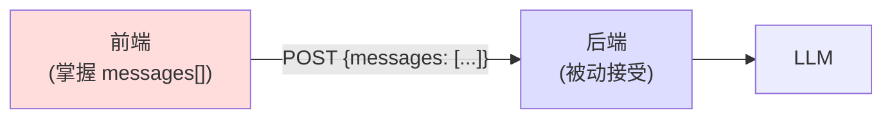
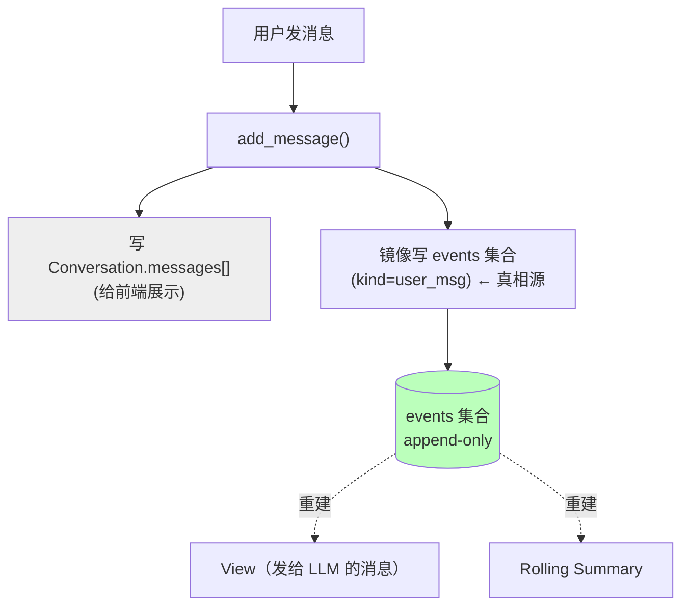
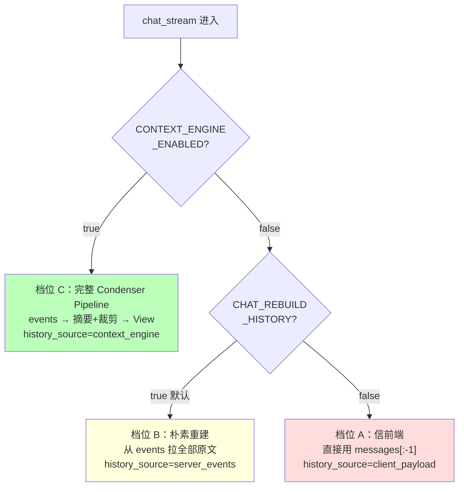
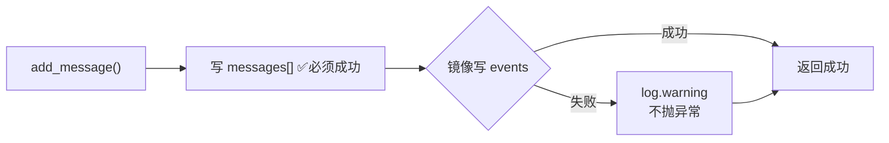

# 03 · 上下文主权：Event Stream 事件溯源

> 上一章末尾我们发现：滚动摘要需要一份可靠的历史，但历史的"主权"在前端手里。本章把主权夺回服务端，引入**事件溯源（Event Sourcing）**思想，建立不可篡改的真相源。

---

## 3.1 痛点：上下文主权在前端，后端被动挨打

回顾最朴素的数据流——后端完全信任前端传来的 `messages[]`：



这个架构有 **5 个结构性问题**（本项目 `内部工程手册` §1（项目内部工程参考手册 `analysis-for-backend/context-engine.md`） 总结）：

1. **上下文主权在前端**：前端一改裁剪策略（比如前端自己加了个滑动窗口），后端行为就跟着漂移，后端根本不知道自己拿到的是不是完整历史。
2. **全量原样拼接**：前端把什么发来后端就用什么，长对话照样爆 token。
3. **RAG 引用只进最后一条 user message**：历史轮里引用过的知识库文件，刷新后无法回显角标。
4. **thinking 分支绕过协议**：开启深度思考时走了另一条代码路径，绕过了 RAG 注入和 XML 输出协议，多路径语义不统一。
5. **`messages[]` 没有派生状态**：它就是一个扁平的消息数组，没有任何结构能支撑"第 80 轮时回忆第 10 轮发生过什么"。

核心病根：**前端的 `messages[]` 是一个"易失、可篡改、结构贫乏"的数据结构，却被当成了上下文的唯一真相源。**

---

## 3.2 灵感：事件溯源（Event Sourcing）

这个问题在传统软件领域早有成熟答案——**事件溯源（Event Sourcing）**，银行系统、订单系统都在用。

核心思想一句话：

> **不要存"当前状态"，而要存"导致状态变化的事件序列"。当前状态是事件回放出来的派生物。**

对比一下两种存储哲学：

```
传统（存状态）:                    事件溯源（存事件）:
┌──────────────┐                  ┌─────────────────────────┐
│ 账户余额: 100 │                  │ 事件1: 开户 +0           │
└──────────────┘                  │ 事件2: 存入 +200         │
   ↑ 只知道结果，                   │ 事件3: 取出 -100         │
     不知道怎么来的                  │ 事件4: 取出 -... wait    │
                                   └─────────────────────────┘
                                      ↑ 余额 = 回放所有事件 = 100
                                        而且完整保留了"怎么来的"
```

事件溯源的好处，恰好治我们的 5 个病：

| 事件溯源特性 | 治哪个病 |
|---|---|
| 事件流是**append-only**（只追加不修改）| 不可篡改的真相源，主权回到服务端 |
| 任何状态都能从事件**重建** | summary、View 都是派生物，可随时重算 |
| 事件可以有**多种类型** | 不只是 user/assistant 文本，还能记 RAG 检索、工具调用 |
| 每个事件带**时间戳和元数据** | 支持"第 80 轮回忆第 10 轮" |

---

## 3.3 落地：Event Stream 作为真相源

本项目据此建了一张 Mongo `events` 集合（`backend/app/models/event.py`），作为上下文的**唯一真相源**。原来的 `conversation.messages[]` 退化成给前端展示用的镜像。



### 9 种事件类型（EventKind）

事件流不再只有"用户说"和"助手说"两种，而是 9 种（`event.py:28`）：

| Kind | 来源 | 作用 |
|---|---|---|
| `user_msg` | 用户消息 | 对话主体 |
| `assistant_msg` | 助手消息 | 对话主体 |
| `tool_call` / `tool_result` | Solo agent 子图 | 工具调用轨迹 |
| `rag_retrieval` / `web_search` | 检索阶段 | 记录"这轮检索了什么" |
| `summary` | `LLMSummarizingCondenser` | 第 2 章的滚动摘要，**回写成一个 event** |
| `memory_flush` | 后台反思 | 标记"截止到这轮已反思过"（第 4 章） |
| `intent_routed` | Context Router | 路由决策的持久化（第 5 章） |

注意 **summary 也是一种 event**——它和原始消息存在同一个事件流里，而不是塞进 `Conversation.metadata` 某个角落。这是刻意的设计：**统一数据源，不让真相分裂到多个地方。**

### turn_id：把一轮的事件绑在一起

每个事件有个 `turn_id`。约定（`_next_turn_id`）：**`user_msg` 开启新一轮（turn_id +1），同一轮里产生的 `assistant_msg`、`tool_call`、`tool_result` 共享这个 turn_id。**

```
turn_id=1:  [user_msg] [assistant_msg]
turn_id=2:  [user_msg] [tool_call] [tool_result] [assistant_msg]
turn_id=3:  [user_msg] [rag_retrieval] [assistant_msg]
                ↑ 同一轮的事件共享 turn_id，方便"按轮"操作
```

这就是为什么第 2 章 `RecentBufferCondenser` 能精确地"保留最近 5 轮"——它按 `turn_id` 切，而不是按消息条数。

---

## 3.4 关键概念：真相源 vs 派生态

有了事件流，整个上下文体系就能分成两类数据，这是理解 Context Engine 的**最重要的一刀**：

```
┌─────────────────────────────────────────────────────────┐
│  真相源（Source of Truth）—— 必须持久化、不可重算            │
│  ┌─────────────────┐  ┌──────────────────┐               │
│  │ events 集合      │  │ memories 集合     │               │
│  │ (原始事件流)      │  │ (跨会话记忆,第4章) │               │
│  └─────────────────┘  └──────────────────┘               │
└─────────────────────────────────────────────────────────┘
                          │ 投影 / 重建
                          ▼
┌─────────────────────────────────────────────────────────┐
│  派生态（Derived）—— 可以随时从真相源重算，丢了不可惜          │
│  ┌─────────────────┐  ┌──────────────────┐               │
│  │ Rolling Summary │  │ View（本轮messages）│              │
│  │ (摘要 event)     │  │ (Condenser 输出)   │              │
│  └─────────────────┘  └──────────────────┘               │
└─────────────────────────────────────────────────────────┘
```

> 🔑 **为什么这一刀如此重要？** 因为它告诉你**哪些东西出了 bug 可以直接重算、哪些绝对不能丢**。Summary 漂移了？删掉重新摘要即可（派生态）。但 events 丢了，一切都无从重建（真相源）。这条线决定了备份策略、容错策略、缓存策略。

---

## 3.5 三档历史来源：渐进式启用

夺回主权不是一刀切——本项目用一个开关 `CONTEXT_ENGINE_ENABLED` 控制三档行为，可以平滑灰度（`chat_service.chat_stream` 第 0 步）：



| 档位 | 行为 | 主权 | 适用 |
|---|---|---|---|
| A `client_payload` | 直接用前端 messages | 前端 | 兜底/最旧行为 |
| B `server_events` | 从 events 重建全部原文（不压缩） | **服务端** | 默认。主权已回服务端，但还没开摘要 |
| C `context_engine` | events → Condenser → View | **服务端** | 完全体。开摘要 + 裁剪 |

> 💡 注意默认值是 **B 档**（`CHAT_REBUILD_HISTORY_FROM_EVENTS=true`）。意思是：**主权默认就在服务端**（从 events 重建），但**摘要默认关闭**（`CONTEXT_ENGINE_ENABLED=false`，因为摘要要额外花 LLM 钱）。这是"先夺主权、再谈优化"的渐进策略。

> ⚠️ **这里藏了一个评测陷阱**（第 6 章详述）：B 档"从 events 拉全部原文"在超长对话里其实就是第 1 章的全量拼接。我们做 LongMemEval 评测时，baseline 走的就是 B 档，靠把 550 条消息全塞给长上下文模型"作弊"般地拿了高分，反而显得开了摘要的 C 档"变差了"——这其实是评测方法选错了，不是 Context Engine 的锅。

---

## 3.6 容错：dual-write 的 fail-soft

写 events 是"镜像"操作——主流程是写 `Conversation.messages[]`，顺带镜像一份到 events。如果镜像失败（Mongo 抖动），**不能让用户的消息发不出去**。所以 `_append_event` 是 fail-soft 的：

```python
async def _append_event(...):
    try:
        await event.insert()
    except Exception as e:
        logger.warning(f"event mirror failed (non-fatal): {e}")
        # 不抛！主流程 add_message 照常返回成功
```



代价：events 流可能偶尔缺一条。但换来的是**记忆系统永远不会拖垮主聊天流程**——这是整个 Context Engine 的铁律：**所有记忆/上下文增强都是 fail-soft 的，坏了最多退化，绝不让用户发不出消息。**

---

## 3.7 本章遗留问题

现在我们有了服务端掌控的、可重建的、结构丰富的事件流。滚动摘要也有了可靠输入。但还有一个维度完全没解决：

```
┌─────────────────────────────────────────────────┐
│  events 流是 *单个会话* 内的。                       │
│                                                   │
│  会话 A（周一）: 用户说"我对花生过敏"                 │
│  会话 B（周五）: 用户问"推荐个菜谱"                   │
│        ↑ 全新的 events 流，里面根本没有"过敏"这条事件   │
│        ↑ 滚动摘要也只摘要会话 B 自己的历史             │
│                                                   │
│  → 跨会话，彻底失忆。又变回金鱼了，只是范围大了点。     │
└─────────────────────────────────────────────────┘
```

滑动窗口治好了"轮内失忆"，事件流+摘要让"单会话内"记得住。但**"跨会话"的长期记忆**还是一片空白。

人类是怎么做的？我们不会把每天的每句话都背下来，但我们会把**重要的事实**（"我朋友对花生过敏"）记进**长期记忆**，几个月后还能想起来。我们需要给 LLM 也配一个这样的"长期笔记本"——而且它得聪明：知道什么该记、什么是更新、什么该忘。

这就是下一章——**跨会话记忆（Durable Memory）与 Mem0**。

➡️ 继续阅读：[第 04 章·跨会话记忆：Mem0 与双时间](04-跨会话记忆·Mem0与双时间.md)
