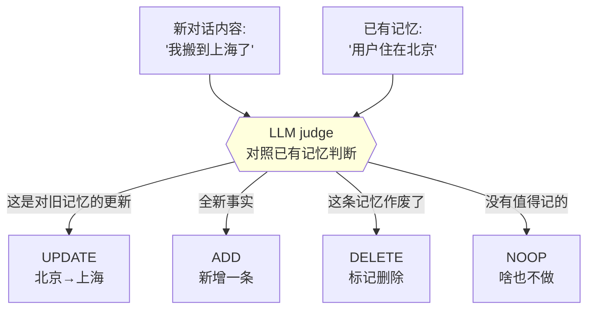
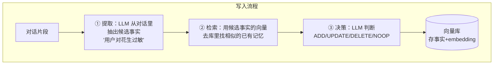
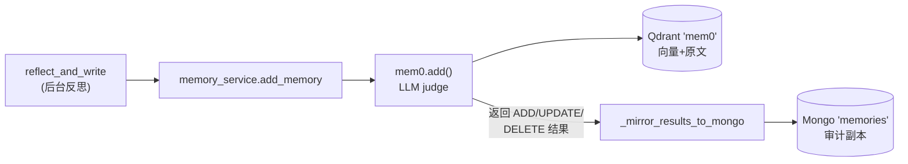
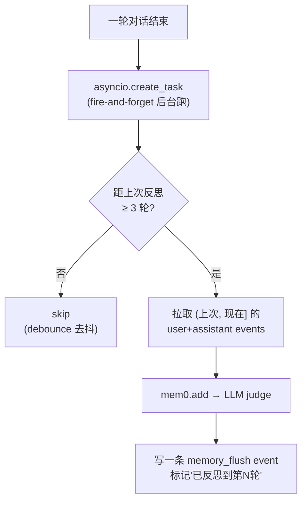
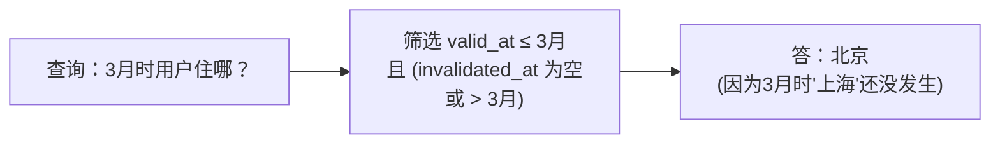
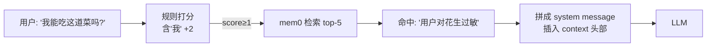

# 04 · 跨会话记忆：Mem0 与双时间

> 前三章解决了"单会话内"的记忆。本章解决"跨会话"的长期记忆——引入 Durable Memory，从零讲清 **Mem0 的底层原理**、为什么需要 **LLM judge**、以及 **Zep 的双时间 schema**。

---

## 4.1 痛点：换个会话就彻底失忆

上一章末尾的场景再看一遍：

```
会话 A（周一）: "我对花生严重过敏" → 写进 A 的 events 流
会话 B（周五）: "推荐个晚餐"        → B 是全新的 events 流，没有"过敏"
                                    → 摘要也只摘 B 自己 → 推荐了花生 💀
```

events 流和滚动摘要都是**会话级（session-scoped）**的。它们让单次对话内记得住，但**跨会话**是隔离的。

我们需要一种**跨会话、长期、持久**的记忆——独立于任何单个会话存在。本项目七层模型里的 **L4 · Durable Memory** 就是干这个的。

---

## 4.2 最朴素的长期记忆：盲追加（为什么不行）

最直觉的方案：每次会话结束，把这次会话的摘要存进一个"长期记忆库"，下次任何会话都带上。

```python
# 朴素方案
long_term_memory = []
def on_session_end(session):
    long_term_memory.append(summarize(session))   # 盲目追加
```

这就是**盲追加（blind append）**。它有三个致命问题：

### 问题 A：无限膨胀

聊了 100 次，记忆库里就有 100 段摘要，全部带上 → 又回到第 1 章的 token 爆炸，只是换了个地方爆。

### 问题 B：矛盾共存

```
记忆1（1月）: "用户住在北京"
记忆2（6月）: "用户搬到了上海"
       ↑ 两条都在库里，模型同时看到 → 到底住哪？精神分裂
```

盲追加不知道"上海"是对"北京"的**更新**，于是矛盾的信息并列存在。

### 问题 C：噪声淹没信号

每次会话的摘要里 90% 是无关闲聊。盲追加把"用户对花生过敏"（关键）和"用户今天心情不错"（噪声）一视同仁地存下来，关键信息被噪声淹没。

> 📌 这其实是第 1 章"滑动窗口不区分信息重要性"的同一个病，在长期记忆层面复发了。我们需要的不是"无脑存全部"，而是**智能地决定：什么该记、什么是对旧记忆的更新、什么该删、什么压根不用记。**

---

## 4.3 灵感：Mem0 —— 用 LLM 当"记忆管理员"

这正是 **Mem0**（一个开源记忆层，本项目用的就是它）解决的问题。Mem0 的核心思想：

> **把"要不要记、怎么记"这个决策，交给一个 LLM 来做。**

每当有新的对话内容进来，Mem0 不是盲目追加，而是先让 LLM 对照**已有记忆**做一个判断，输出四种操作之一：



| 操作 | 含义 | 例子 |
|---|---|---|
| **ADD** | 全新事实，新增 | "我对花生过敏" → 库里没有，新增 |
| **UPDATE** | 与已有记忆冲突，是更新 | "我搬到上海" → 覆盖"住在北京" |
| **DELETE** | 旧记忆已失效 | "我不再用 Python 了" → 删掉"用户用 Python" |
| **NOOP** | 没有值得长期记的 | "今天天气不错" → 忽略 |

这个"LLM judge"机制就是 Mem0 区别于盲追加的灵魂。Mem0 论文实测，相比盲追加摘要，这套机制能带来 **+5.5 个百分点**的准确率提升，同时大幅减少 token 占用（因为记忆库保持精简、无矛盾）。

### Mem0 的底层原理（两段式）

Mem0 内部其实是**"提取 + 决策"两段式 LLM 调用** + **向量存储**：



1. **提取（Extract）**：LLM 从原始对话里抽出"值得记的事实"，过滤掉闲聊噪声。
2. **检索（Retrieve）**：把候选事实编码成向量，去已有记忆库里搜相似的——找出"可能相关/冲突的旧记忆"。
3. **决策（Decide）**：LLM 看着"候选事实 + 相似的旧记忆"，决定是 ADD 还是 UPDATE 还是别的。

读取时则是纯向量检索：把用户当前问题编码成向量，去库里找最相关的 K 条记忆。

> 🧠 **为什么用向量存储？** 因为记忆检索是"语义匹配"而非"关键词匹配"。用户问"我能吃这道菜吗"，要能召回"对花生过敏"这条记忆——靠的是语义相似度（embedding 余弦距离），不是字面匹配。本项目用 BGE-M3 做 embedding，存在 Qdrant 的一个**独立** collection（叫 `mem0`，和知识库的 `kb_main` 分开）。

---

## 4.4 本项目怎么用 Mem0：薄包装 + Mongo 双写

本项目没有裸用 Mem0，而是在外面包了一层 `memory_service.py`，干两件额外的事：

1. **配置 Mem0 用本项目的模型**：LLM judge 用 DeepSeek，embedding 用本地 BGE-M3，向量库用 Qdrant（`_build_mem0_config`）。
2. **双写一份审计副本到 Mongo**：Mem0 自己把记忆存在 Qdrant 里（向量+原文），但那是个黑盒。我们在 Mongo `memories` 集合里再存一份**结构化副本**，用于：可在前端审计页查看/编辑/软删、可溯源到原始 events、可做双时间管理（下一节）。



---

## 4.5 写入时机：后台反思 + debounce

什么时候触发 Mem0 写入？不是每轮都触发（太贵），而是**对话进行中，每隔几轮，在后台异步反思一次**。

关键设计（`reflect_and_write`，`memory_service.py:391`）：



三个要点：

- **fire-and-forget**：`asyncio.create_task` 扔到后台，**不阻塞用户拿回复**。请求路径零额外延迟。
- **3 轮 debounce**：`MEMORY_REFLECT_DEBOUNCE_TURNS=3`，最多每 3 轮反思一次。控制成本（每次反思约 $0.003）。
- **memory_flush event**：反思完写一条 `memory_flush` 事件到事件流，标记"截止到第 N 轮已经反思过了"。下次反思读它，只处理增量的新对话。

> 🔗 看到没？这里又用到了第 3 章的 **events 事件流**——`memory_flush` 也是一种 event。事件流不只是给摘要用的，它是整个系统的"账本"，连"后台反思进度"都记在上面。

---

## 4.6 双时间 schema：借鉴 Zep，永不物理删除

UPDATE 和 DELETE 引出一个微妙问题：**旧记忆该怎么处理？**

直觉是"直接删掉/覆盖"。但本项目借鉴了 **Zep**（另一个记忆系统）的**双时间（bi-temporal）**设计，选择**永不物理删除**，只打标记。

`MemoryRecord`（`backend/app/models/memory.py`）的关键字段：

```python
class MemoryRecord(Document):
    object: str                      # 事实文本，如 "用户住在上海"
    valid_at: datetime               # 这条事实"在世界上"生效的时间
    invalidated_at: datetime | None  # 被新事实覆盖的时间（None=仍有效）
    superseded_by: str | None        # 指向取代它的新记录 ID
    source_event_ids: list[str]      # 来自哪些 events（溯源）
```

当"北京"被"上海"更新时，发生的不是删除，而是：

```
更新前:
  ┌────────────────────────────────────┐
  │ id=001  "住在北京"                    │
  │ valid_at=1月  invalidated_at=None ✅ │ ← 当前有效
  └────────────────────────────────────┘

UPDATE "搬到上海" 后:
  ┌────────────────────────────────────┐
  │ id=001  "住在北京"                    │
  │ valid_at=1月  invalidated_at=6月 ❌  │ ← 标记失效，但没删
  │ superseded_by=002 ──────────┐       │
  └─────────────────────────────┼───────┘
  ┌─────────────────────────────▼───────┐
  │ id=002  "住在上海"                    │
  │ valid_at=6月  invalidated_at=None ✅ │ ← 新的有效记录
  └────────────────────────────────────┘
```

为什么这么麻烦？因为这样可以**回溯"任意时间点，模型当时认为事实是什么"**：



| 好处 | 说明 |
|---|---|
| **可审计** | 前端审计页能看到记忆的完整变更历史，失效的灰显带删除线 |
| **可恢复** | LLM judge 误判把不该删的删了？清掉 `invalidated_at` 就恢复了 |
| **可回溯** | "用户上个月的需求是什么" 这种时间相关查询能答对 |

> 💡 **"双时间"的含义**：一个时间轴是"事实在世界上何时为真"（`valid_at`），另一个是"系统何时认为它不再为真"（`invalidated_at`）。两条时间轴解耦，才能精确回答"过去某刻的认知状态"。这是金融、审计系统的成熟范式，Zep 把它引入了 AI 记忆。

---

## 4.7 读取：什么时候该注入记忆？

写好了记忆，读取时不能每次都盲目把记忆塞进 context（又是 token 浪费）。需要判断"这个问题是否需要长期记忆"。

本项目用一个轻量**规则打分器**（`context_router.decide_memory_injection`）：

```
用户问句 → 规则打分:
  含代词/回指（"那个"、"它"、"上次说的"）  +2
  含自指（"我的"、"我之前"）              +2
  命令式新任务（"帮我写个..."）           -1
  ...
  score ≥ 1 → 触发记忆检索
```



为什么用规则而不用 LLM 判断？因为 **90% 的情况规则就够了，而且规则是 <1ms 的零成本**。LLM 判断留作未来的"慢路径"备用。这是典型的**快慢路径**设计——常见情况走廉价快路径，疑难情况才上昂贵慢路径。

---

## 4.8 Mem0 的踩坑清单（footgun）

本项目实战中踩出来的坑，记下来防止重蹈：

| 坑 | 后果 | 对策 |
|---|---|---|
| 同时启用 mem0 + memori | memori 会 monkey-patch OpenAI SDK，污染全局 client | 只用 mem0 |
| mem0 的 Qdrant collection 和知识库共用 | 记忆向量和知识库向量混在一起 | 强制独立 collection（`mem0` ≠ `kb_main`） |
| embedding 维度不对齐 | 切模型后向量库报维度错 | 硬约束 1024 维（BGE-M3） |
| 不传 `user_id` 给 mem0 | 跨用户记忆串台、误去重 | 永远传 `user_id` |
| 把 RAG 的知识库 chunk 喂给记忆写入器 | 把"知识"误记成"用户事实" | 只喂真正的**对话 turn** |

---

## 4.9 当前缺陷：扁平记忆，没有"关系"

Mem0 给了我们跨会话记忆，但它存的是**一条条孤立的事实字符串**：

```
"用户对花生过敏"
"用户在用 PostgreSQL"
"用户决定用 SQLAlchemy"
"用户的项目托管在 AWS"
```

这些事实之间的**关系**丢失了。如果用户问"我之前关于数据库的所有技术决策？"，向量检索只能召回零散的、可能不全的几条，没法回答"PostgreSQL → 配 SQLAlchemy → 托管 AWS → 用 PgBouncer 连接池"这样的**关系链**。

```
Mem0（扁平）:              理想（图谱）:
  • 过敏                    PostgreSQL ──决定用──> 项目
  • PostgreSQL                  │
  • SQLAlchemy                  ├──搭配──> SQLAlchemy
  • AWS                         ├──托管于──> AWS
  ↑ 一堆点，没有线              └──连接池──> PgBouncer
                              ↑ 实体 + 关系，能遍历
```

业界更前沿的方案（如 **Graphiti / Zep** 的知识图谱）会把记忆组织成**实体-关系图**，支持图遍历查询。本项目目前是 Mem0 的扁平方案，这是一个已知的能力边界。

> 📎 本项目对 Graphiti 的详细差距分析见 项目内部设计文档（项目内部设计文档）。务实结论：当前 Mem0 够用；若要对齐图谱能力，中期可把 Mem0 后端换成 Graphiti（我们的双时间 schema 已经是 Zep 风格，迁移成本可控）。

---

## 4.10 本章遗留问题

现在我们手里的"上下文来源"越来越多了：

```
该塞进 context 的候选：
  ┌──────────────────────────┐
  │ • 系统 prompt（身份/规则）   │
  │ • 最近 N 轮原文            │
  │ • 滚动摘要                 │
  │ • 跨会话记忆命中           │  ← 第 4 章
  │ • 知识库 RAG 检索结果      │
  │ • 联网搜索结果            │
  └──────────────────────────┘
        全部加起来，又超 token 了！
        到底该塞哪些？塞不下时先撕哪张便利贴？
```

每一种来源都觉得自己重要。但 token 预算是死的。我们需要一个**调度器**：决定每一轮该召回哪些来源（路由），以及当总量超预算时按什么优先级取舍（装配）。

这就是下一章——**Router（路由）与 Assembler（装配）**。

➡️ 继续阅读：[第 05 章·按需装配：Router 与 Assembler](05-按需装配·Router与Assembler.md)
