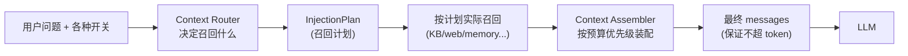
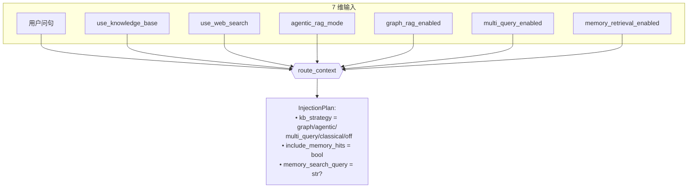
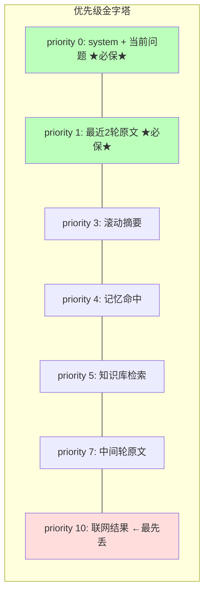
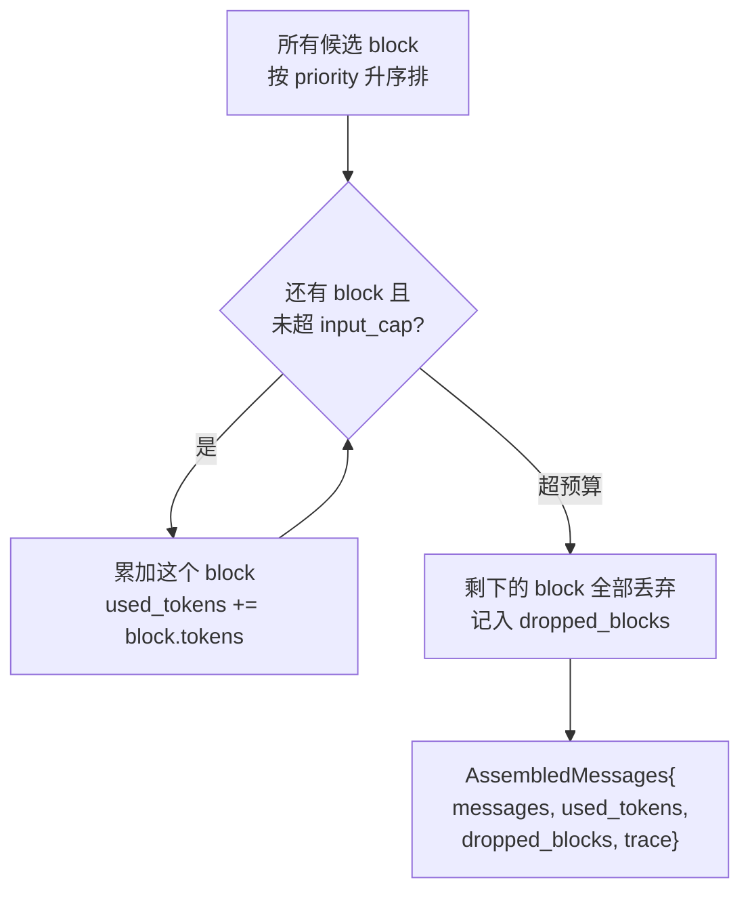
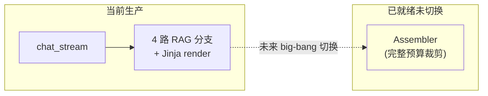
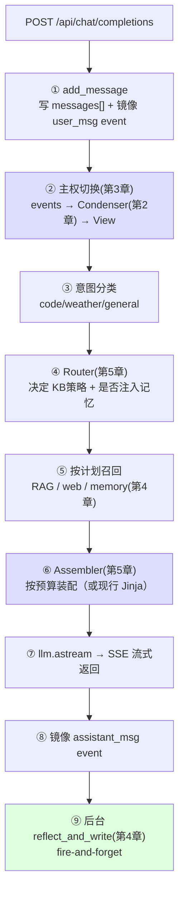

# 05 · 按需装配：Router 与 Assembler

> 前四章我们攒下了一堆"该塞进 context 的候选来源"。本章解决最后一个工程问题：**每轮该召回哪些？塞不下时按什么优先级取舍？** 引入操作系统式的 Router + Token Budget + Assembler。

---

## 5.1 痛点：来源太多，预算太少

到第 4 章结束，我们能往 context 里塞的东西有六七种：

```
┌─────────────────────────────────────────┐
│ 候选来源              典型大小              │
├─────────────────────────────────────────┤
│ 系统 prompt           固定 ~500 token     │
│ 当前用户问题          ~50 token           │
│ 最近 N 轮原文         ~2000 token         │
│ 滚动摘要              ~300 token          │
│ 跨会话记忆命中        ~500 token          │
│ 知识库 RAG 检索       ~3000 token（大！）  │
│ 联网搜索结果          ~4000 token（更大！）│
└─────────────────────────────────────────┘
        全塞 ≈ 10000+ token，且每轮都在变
```

两个独立的问题混在一起：

1. **要不要召回？**（路由问题）—— 这一轮用户就问个"你好"，根本不需要查知识库、不需要联网、不需要翻记忆。盲目全召回 = 浪费钱 + 拖慢响应。
2. **召回了塞不下怎么办？**（预算问题）—— 就算该召回的都召回了，加起来超了模型上限，必须有取舍：先撕哪张便利贴？

本项目把这两个问题拆给两个组件：**Context Router**（管召回决策）和 **Context Assembler**（管预算取舍）。



---

## 5.2 灵感：操作系统的资源调度

这个问题的形态，和**操作系统管理内存**几乎一模一样：

| 操作系统 | 上下文工程 |
|---|---|
| 物理内存有限 | token 预算有限 |
| 多个进程都想要内存 | 多个来源都想进 context |
| 调度器决定谁运行 | Router 决定召回什么 |
| 内存不够时按优先级换出页面 | Assembler 按优先级丢弃 block |
| 关键内核页常驻不换出 | 系统 prompt / 当前问题必保 |

所以我们直接借用操作系统的思路：**优先级 + 预算 + 抢占式裁剪**。

---

## 5.3 Router：7 维路由决策

`route_context`（`context_router.py`）把分散在各处的开关汇总成一个统一的**注入计划（InjectionPlan）**。它综合 7 个维度：



其中知识库检索策略有优先级（互斥选一个）：

```
graph > agentic > multi_query > classical > off
  ↑ 最强但最贵                          ↑ 不查
```

为什么要有优先级而不是全开？因为这几种 RAG 策略是**不同档位的同一件事**（都是"检索知识库"），同时开既矛盾又浪费。Router 按用户配置选**最高档的那一个**。

> 📌 Router 首版是**纯规则快路径**——90% 的流量走 <1ms 的规则判断，不调 LLM。复杂场景（模糊代词、跨 session 回指）的 LLM 慢路径作为未来扩展预留。这又是第 4 章见过的**快慢路径**哲学。

---

## 5.4 Token Budget：给每种来源标优先级

Assembler 的核心是一张**优先级表（TokenBudget.block_priority）**。每种来源被赋予一个优先级数字，**数字越小越优先保留，越大越先被丢弃**：

```
priority  block               必保?    撕便利贴顺序
────────────────────────────────────────────────
   0      系统 prompt          ✓必保    ┐
   0      当前用户问题          ✓必保    │ 这些绝不丢
   1      最近 2 轮原文(tail)   ✓必保    ┘
────────────────────────────────────────────────
   3      滚动摘要              次优先   ┐
   4      跨会话记忆命中        次优先   │ 预算紧张时
   5      知识库检索结果        次优先   │ 从下往上丢
   7      中间轮原文(middle)    可丢     │
  10      联网搜索结果          最先丢   ┘← 第一个被撕
```



这个排序背后是有道理的取舍：

- **系统 prompt 和当前问题**：丢了就没法对话了，绝对必保。
- **最近 2 轮原文**：连贯性的命脉，优先级仅次于必保。
- **滚动摘要 > 记忆 > 知识库**：摘要是"本会话的浓缩历史"，比外部召回更贴近当前语境。
- **联网结果优先级最低**：它最大（4000 token）、最易过时、最容易"宁可不要"。预算一紧，第一个撕它。

---

## 5.5 Assembler：按预算累加装配

`assemble_messages`（`context_assembler.py`）的算法很简单——**按优先级从小到大累加 token，超了就停**：



用一个具体例子。假设 `input_cap = 6000 token`：

```
按优先级累加:
  priority 0  system(500)        累计 500   ✅
  priority 0  当前问题(50)         累计 550   ✅
  priority 1  最近2轮(2000)        累计 2550  ✅
  priority 3  滚动摘要(300)        累计 2850  ✅
  priority 4  记忆命中(500)        累计 3350  ✅
  priority 5  知识库(3000)         累计 6350  ❌ 超了6000!
  ────────────────────────────────────────
  → 知识库这一块放不下，丢弃（或部分截断）
  → priority 7、10 的也一并丢弃
  → 最终 used_tokens=3350, dropped=[知识库, 中间轮, 联网]
```

输出带完整的 `trace`（丢了什么、用了多少 token），方便事后在 LangSmith 里观测"这一轮为什么没用上知识库"。

> 🛡️ **防御性兜底**：代码里对 priority=1 的"最近 2 轮"有特判——即使预算极紧，也会强制把它重新追加进去。因为丢了最近的对话，模型会瞬间"失忆"，体验崩坏。宁可丢知识库，不能丢眼前的对话。

---

## 5.6 estimate_tokens：怎么知道一段文本多少 token？

装配要算 token，但精确算 token 要跑 tokenizer（慢）。本项目用一个**粗估**：

```python
def estimate_tokens(text: str) -> int:
    return len(text) // 2     # 中文约 2 字符/token 的经验值
```

为什么敢用这么糙的估算？因为 Assembler 要的不是精确值，而是"够不够塞得下"的**量级判断**。粗估 + 留安全余量（`input_cap` 设得比模型真实上限小）就够了。精确 tokenizer 的开销在每轮装配里不划算。

---

## 5.7 现状：能力已就绪，但未强制切换

这里要诚实说明本项目的真实状态（`内部工程手册 §5.4`）：

> **Assembler 的完整预算裁剪逻辑已经实现并测试，但首版没有强制让 `chat_stream` 去调用它。** 现有的 4 路 RAG 分支 + Jinja 模板渲染仍在生产中跑。



为什么不立刻切？因为现有的 Agentic RAG / Graph RAG / Multi-Query 四路分支是**生产中验证过的**，贸然换成统一 Assembler 风险大。策略是**先让 Assembler 在旁边 soak（观察）成熟，再做一次性切换**。这是大型重构的稳妥做法——**新机制先并行存在、可观测，确认无误再替换旧机制**。

---

## 5.8 完整数据流：七层如何协同

到这里，七层上下文模型的所有组件都齐了。串起来看一次完整请求（`内部工程手册 §4` 的精简版）：



每一层都对应前面某一章解决的痛点：

| 步骤 | 来自哪章 | 解决的痛点 |
|---|---|---|
| ② 主权切换 + Condenser | 第 2、3 章 | token 爆炸 + 金鱼记忆 + 前端主权 |
| ④ Router | 第 5 章 | 盲目召回浪费 |
| ⑤ 记忆召回 | 第 4 章 | 跨会话失忆 |
| ⑥ Assembler | 第 5 章 | 超预算取舍 |
| ⑨ 后台反思 | 第 4 章 | 长期记忆沉淀 |

---

## 5.9 本章遗留问题

我们已经走完了从"全量拼接"到"七层上下文操作系统"的完整演化。但还有两个元问题没回答：

```
┌────────────────────────────────────────────────┐
│ 1. 凭什么这么选？                                  │
│    每一步我们都"参考了业界"——OpenHands 的摘要、     │
│    Mem0 的 judge、Zep 的双时间... 但这五家产品      │
│    各自的取舍是什么？我们抄了什么、放弃了什么、为什么？ │
│                                                  │
│ 2. 怎么证明它真的有效？                             │
│    第 2 章说"Probe 评测实测无损"——这个评测怎么做的？ │
│    为什么不用业界流行的 LongMemEval？               │
└────────────────────────────────────────────────┘
```

最后一章回答这两个问题：**取舍的依据**和**验证的方法**。

➡️ 继续阅读：[第 06 章·取舍：五家产品对比与如何验证](06-取舍·五家产品对比与如何验证.md)
