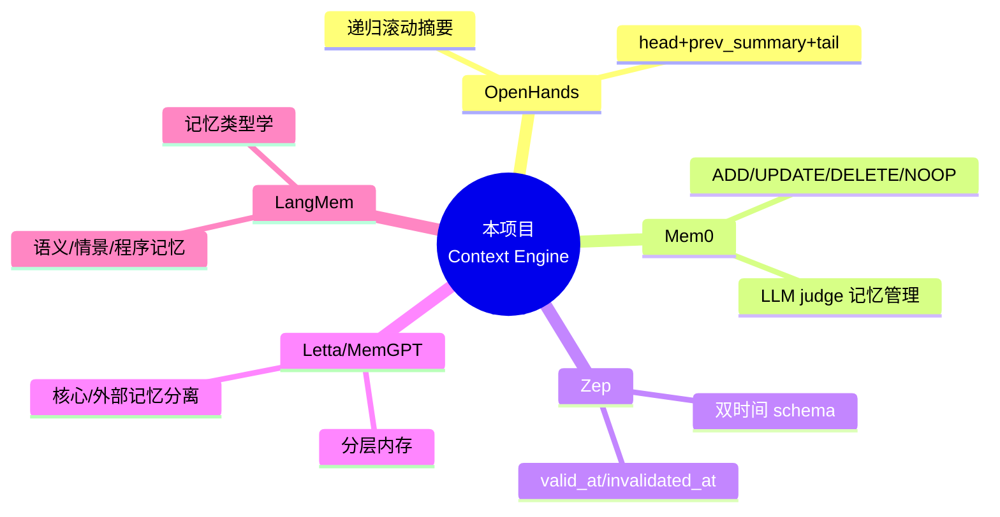
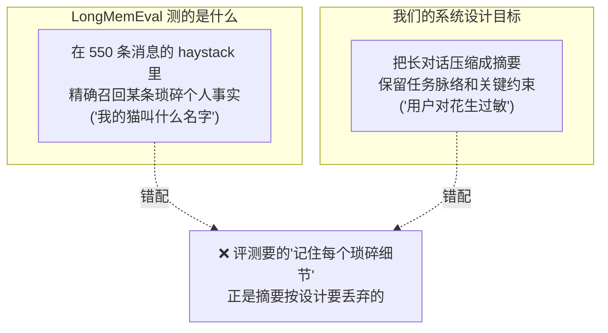
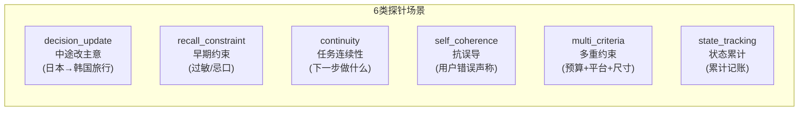
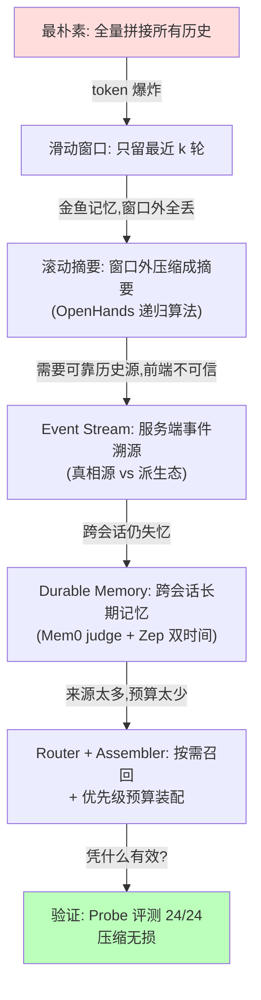

# 06 · 取舍：五家产品对比与如何验证

> 收尾章。回答两个元问题：(1) 一路上我们参考了 OpenHands / Mem0 / Zep / Letta / LangMem 五家，各自取舍是什么、我们如何选择；(2) 怎么证明这套上下文架构真的有效——为什么 LongMemEval 不适用、Probe 评测怎么做到 100%。

---

## 6.1 我们站在五个巨人的肩膀上

回顾整个演化，每一步都有业界来源。先把五家产品的"一句话定位"摆出来：



| 产品 | 它最擅长 | 底层机制 | 我们抄了什么 | 我们放弃了什么 | 为什么 |
|---|---|---|---|---|---|
| **OpenHands** | agent 长任务的上下文压缩 | 递归滚动摘要 condenser | ✅ `LLMSummarizingCondenser` 整个算法 | 它的 agent event 模型（我们用自己的 EventKind） | 摘要算法是通用的；event 模型要贴合我们的对话场景 |
| **Mem0** | 记忆的增删改判断 | LLM judge + 向量库 | ✅ 直接用作 durable memory 后端 | 不让它管理短期对话（那是 Condenser 的活） | 让专业的组件干专业的事，不越界 |
| **Zep / Graphiti** | 时序知识图谱 | 双时间 + 实体关系图 | ✅ 双时间 schema（valid_at/invalidated_at/superseded_by） | ❌ 知识图谱 + 图遍历 | 图谱构建/查询成本高，扁平 Mem0 当前够用 |
| **Letta (MemGPT)** | OS 式分层内存 | 核心记忆 vs 外部记忆 + 自主换页 | ✅ "分层 + 预算换出"思想（七层模型 + Assembler） | 它的"LLM 自主决定换页" | LLM 自主换页不可控；我们用确定性优先级表 |
| **LangMem** | 记忆类型学 | 语义/情景/程序三类记忆 | ✅ MemoryKind 分类（user_preference/project_fact/...） | 它的完整 LangGraph 集成 | 只取分类思想，不绑死框架 |

> 🎯 **选择的一以贯之的原则**：**取思想，不取实现绑定**。我们从每家学一个核心 idea，但都用自己可控的方式落地，避免被任何单一框架绑架。所有外部依赖（Mem0）都包一层 service，随时可替换。

---

## 6.2 一条主线：确定性 vs LLM 自主

把五家的取舍归纳一下，会发现一条贯穿始终的张力轴：

```
确定性/规则                                      LLM 自主/智能
（快、便宜、可控、可测）                          （灵活、智能、贵、不可控）
    │                                                    │
    ├── RecentBufferCondenser（纯规则切窗口）              │
    ├── Router 快路径（规则打分）                          │
    ├── Assembler（确定性优先级表）                        │
    │                          ├── LLMSummarizingCondenser（LLM 摘要）
    │                          ├── Mem0 judge（LLM 决定增删改）
    │                          ├── Router 慢路径（未来，LLM 判断）
    │                          └── Letta 自主换页（我们放弃了）
```

**本项目的取舍倾向：能用规则的地方坚决用规则，只在"判断质量决定成败"的地方才上 LLM。**

- 切窗口、定优先级、装配预算 → 规则（确定、零成本、可单测）
- 摘要内容、判断记忆增删改 → LLM（需要语义理解，规则做不了）

为什么不像 Letta 那样让 LLM 全权自主？因为**不可控、不可测、贵**。一个能跑 26 个确定性单测的 Condenser，比一个"LLM 自己看着办"的黑盒，在生产上可靠得多。

---

## 6.3 全部默认 off：渐进式启用哲学

还有一个关键工程取舍：**所有新能力默认关闭，按里程碑顺序逐个翻启**。

```
M0 起点
 └→ M1: CHAT_REBUILD_HISTORY_FROM_EVENTS=true  （主权回服务端，默认已开）
     └→ M2: CONTEXT_ENGINE_ENABLED            （开滚动摘要，要花 LLM 钱）
         └→ M3: MEMORY_REFLECT_ENABLED         （开后台反思，先 soak 观察）
             └→ M3.5: MEMORY_RETRIEVAL_ENABLED  （开记忆召回注入）
                 └→ M4/M5: Assembler 切换、Task 隔离（等评测验证）
```

为什么这么保守？因为**上下文系统是聊天体验的命脉**，任何一个组件出 bug 都直接伤害用户。默认 off + 逐个翻启 = 出问题时能快速定位是哪个开关引入的，也能随时回退。配合"所有组件 fail-soft"，构成双保险。

---

## 6.4 如何验证：一场关于"评测方法"的教训

理论再漂亮，也得拿数据说话。但**怎么评测一个记忆/压缩系统**本身就是个深坑——本项目实打实踩了一次，值得讲。

### 第一次尝试：LongMemEval，结果"灾难性"

LongMemEval 是业界流行的长期记忆评测集。我们跑了 50 题 × 4 配置，结果吓人：

| 配置 | 准确率 |
|---|---|
| `baseline_off`（不压缩，全塞） | **56%** |
| `condenser_only`（开滚动摘要） | **0%** |
| `condenser_reflect` | 2% |
| `full` | 2% |

**开了 Context Engine 反而从 56% 暴跌到 0%？！** 第一反应是"我们的摘要把信息全压没了，系统是失败的"。

### 复盘：是评测方法选错了，不是系统坏了

深挖下去发现是**评测与系统的范式错配**：



更要命的是 baseline 的 56% 是**"作弊"得来的**：

- `baseline_off` 走第 3 章的 **B 档**（从 events 拉全部 550 条原文）
- 等于把 550 条消息**全塞**给长上下文模型，靠模型自己在大海里捞针
- 这恰恰是第 1 章我们要消灭的"全量拼接"！它在这个评测里反而占便宜

而 `condenser_only` 把 550 条压成摘要——评测要的"猫叫什么名字"这种琐碎细节，**正是摘要按设计丢弃的**。所以 0% 不是 bug，是**评测方法问错了问题**。

> 🎓 **教训**：评测必须匹配系统的**设计目标**。LongMemEval 测的是"检索系统的事实召回"，而我们的 Condenser 是"压缩系统的脉络保持"。拿测渔网的标准去测水桶，水桶当然"漏水"。

> （补充：这次评测还暴露了第 2 章那个 datetime 时区 bug——后期 9 题 condenser 静默降级。修复后才有干净数据。）

### 第二次尝试：Probe 评测，对症下药

我们改用 **Probe-based 评测**（借鉴 Factory.ai 的 probe 方法），专测我们真正关心的能力：**在中等长度真实对话里，压缩后还能不能正确接着对话**。

设计 6 个 25-30 轮的场景，每个埋一个"探针问题"，考察压缩是否保住了关键信息：



每个场景跑 4 个配置，LLM judge 打分。结果：

| 配置 | 准确率 | 平均延迟 | 摘要覆盖 |
|---|---|---|---|
| `baseline_off` | 6/6 (100%) | 29.4s | — |
| `condenser_only` | **6/6 (100%)** | 69.1s | 14.3 events |
| `condenser_reflect` | **6/6 (100%)** | 59.6s | 14.3 events |
| `full` | **6/6 (100%)** | 62.2s | 14.3 events |

**24/24 全对。** 结论清晰：

> **在 25-30 轮的真实对话里，Context Engine 的压缩对答案质量是无损的**——该答对的全答对。代价只是每轮多 30-40 秒的摘要 LLM 调用延迟（可接受，且可优化）。

这才是对我们系统设计目标的正确度量。

---

## 6.5 评测哲学的沉淀

这次"LongMemEval 翻车 → Probe 成功"的经历，沉淀出几条评测原则：

| 原则 | 含义 |
|---|---|
| **评测匹配目标** | 先想清楚系统**设计来解决什么**，再选/造评测。别拿热门 benchmark 硬套。 |
| **警惕"作弊"的 baseline** | baseline 拿高分不一定是好事——要看它是不是用了你正想消灭的方式（全量塞）。 |
| **延迟也是指标** | 准确率 100% 但慢 40s，要诚实报告，别只报准确率。 |
| **小而真 > 大而假** | 6 个精心设计的真实场景，比 50 个范式错配的题更有信息量。 |

> 📎 完整评测方法论见 项目内部设计文档（项目内部设计文档），评测脚本在 `backend/scripts/{run_probe_bench,score_probe_bench,probe_scenarios}.py`。

---

## 6.6 全景回顾：我们爬完的这座山

从第 1 章的金鱼，到现在的七层上下文操作系统，完整路径：



每一层都不是凭空设计的，而是**被上一层的痛点逼出来的**：

```
痛点 → 方法 → 灵感来源 → 改进 → 新痛点 → ...

token爆炸  → 滑动窗口  → 人类对话直觉    → 封顶   → 金鱼记忆
金鱼记忆   → 滚动摘要  → OpenHands      → 不失忆 → 需要可靠历史源
前端主权   → 事件溯源  → Event Sourcing → 服务端 → 跨会话失忆
跨会话失忆 → Mem0      → Mem0+Zep       → 长期记 → 扁平无关系
预算超限   → Router+Assembler → 操作系统调度 → 可控  → 怎么证明有效
怎么证明   → Probe评测 → Factory.ai     → 100%  → (持续优化)
```

---

## 6.7 未竟之路（诚实的边界）

本教程讲的是"已经走到哪"，也要讲"还没走到哪"（`内部工程手册 §12`）：

- **Assembler 尚未强制切换**：现行仍跑 4 路 RAG 分支 + Jinja，Assembler 在旁 soak。
- **记忆仍是扁平的**：无实体解析、无图遍历。对齐 Graphiti 是中期选项。
- **Router 仅规则快路径**：LLM 慢路径（处理模糊回指）未启用。
- **摘要抗漂移的"20 轮重摘要校验"**：设计里有，首版未实现。
- **TaskContext 任务隔离**：Solo agent 的任务记忆隔离目前只是 envelope 脚手架。
- **@pin 指令**：前端能解析 `@kb/@memory/@last-turn`，后端尚未消费。

这些不是"忘了做"，而是**刻意的优先级排序**——先把主干（压缩 + 记忆 + 主权）做扎实并验证，枝叶等主干 soak 成熟、benchmark 验证后再上。

---

## 结语

上下文工程的本质，从第一章到最后一章，始终是同一句话：

> **如何用有限的便利贴，让一个会失忆的天才，表现得像一个有完整记忆的人。**

我们的答案是：**分层存储**（七层模型）+ **递归压缩**（Condenser）+ **可靠真相源**（Event Stream）+ **智能长期记忆**（Mem0 + 双时间）+ **预算化装配**（Router + Assembler），再用**对症的评测**（Probe）证明它有效。

每一块都站在巨人的肩膀上，但都用我们自己可控、可测、可回退的方式落地。

---

📚 **延伸阅读**
- 工程参考手册（配置/测试/兜底全表）：`内部工程手册`（项目内部工程参考手册 `analysis-for-backend/context-engine.md`）
- 设计蓝图（970 行调研）：项目内部设计文档
- Graphiti 对比：项目内部设计文档
- 评测方法论：项目内部设计文档

⬅️ 返回：[第 00 章·导读](00-导读·学习路线图.md)
