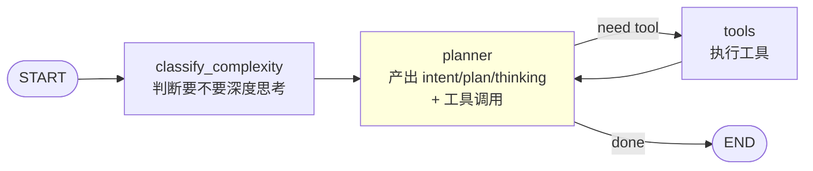

# 本项目的思维链（COT / Chain of Thought）实现

> 一句话结论：**实现了，而且是多种形态并存**。但要分清——有些是正统 COT（模型给答案前先输出推理），有些是"推理链"的近亲（agentic reasoning / reflection），概念上不完全等同。
>
> 关键设计哲学：**按需付费**。Classic 默认不思考（省 token/延迟），只在用户显式开启 thinking、或 Solo 自己判定复杂时才推理——与 Context Engine "能用规则就别上 LLM" 同源。

---

## 形态总览

| 形态 | 是不是 COT | 在哪 | 机制 |
|---|---|---|---|
| DeepSeek 原生 reasoning | ✅ 正统 COT | Classic + Solo | 模型原生能力 |
| Solo ReAct + `<thinking>` 标签 | ✅ Agentic COT | LangGraph planner 环 | 结构化输出 |
| `request_thinking` 元工具 | ✅ prompt 式 COT（按需触发） | Solo 工具 | LLM 自主决策 |
| Agentic RAG 评分/改写/查幻觉 | ⚠️ 推理但非 COT（属反思 reflection） | classic 路径 RAG | 结构化 JSON 判断 |
| Classic 普通回答 | ❌ 无 COT | 默认 | 直接作答 |

---

## 一、最接近经典 COT：模型原生深度思考（reasoning）

这是最正统的 COT——模型在给答案前先输出一段推理过程。项目用的是 **DeepSeek 原生 reasoning 能力，不是 prompt 工程**。

### Classic 路径

`backend/app/services/chat_service.py:481-507`，`chat_stream_with_thinking()`：

```python
async def chat_stream_with_thinking(self, messages):
    client = get_openai(...)                      # 直连 DeepSeek
    stream = await client.chat.completions.create(
        model="deepseek-chat",
        messages=openai_messages,
        stream=True,
        extra_body={"thinking": {"type": "enabled"}},   # ← 开启原生思考
    )
    async for chunk in stream:
        delta = chunk.choices[0].delta
        if hasattr(delta, "reasoning_content") and delta.reasoning_content:
            yield {"type": "reasoning", "text": delta.reasoning_content}  # 推理流
        elif delta.content:
            yield {"type": "content", "text": delta.content}              # 正文流
```

reasoning 和 content 走**两条独立的 SSE 流**——这正是教科书式 COT 的标志：推理过程与最终答案分离。

### Solo 路径

`backend/app/services/solo/nodes.py:48-51`：

```python
if enable_thinking:
    kwargs["extra_body"] = {"thinking": {"type": "enabled"}}
    # 响应 delta 带 reasoning_content，LangChain 透传到
    # AIMessageChunk.additional_kwargs["reasoning_content"]
```

`solo/events.py:46-67` 的 `_extract_reasoning()` 负责兼容不同 LangChain 版本，从 chunk 里抽取 `reasoning_content`。

### 数据流

```
用户开启 thinking
   │
   ▼
chat.py 端点层路由
   │ enable_thinking + deepseek → chat_stream_with_thinking
   ▼
DeepSeek API（extra_body thinking=enabled）
   │
   ├─ reasoning_content 流 → SSE {"reasoning": "..."}  ─┐
   └─ content 流          → SSE {"content": "..."}    ─┤
                                                        ▼
                                          前端累积到 msg.reasoning / msg.content
                                                        ▼
                                          ChatArea.vue 渲染"💭 思考过程"折叠块
```

> ⚠️ **端点层路由的红线**：intent 路由必须在 `chat.py` 端点层完成。因为 `enable_thinking=true` 走 `chat_stream_with_thinking` 这条 parallel 分支会绕过 `chat_stream` 内部逻辑。其中 `intent=="code" + enable_thinking` 时**沉默地保 thinking 走 DeepSeek**（不切 Doubao，因 Doubao 代码模型不支持 thinking）。

---

## 二、Agentic COT：Solo 路径的 ReAct + 显式 `<thinking>`

Solo 路径（LangGraph）本身是 **ReAct 模式**（Reasoning + Acting 交替），这是 COT 在 agent 场景的自然延伸。

### 图拓扑

`backend/app/services/solo/graph.py`：

```
START → classify_complexity → planner ⇄ tools → END
                                  │
                          （推理 → 行动 → 观察 → 再推理 的 ReAct 环）
```



### 三个推理触点

1. **complexity classifier 节点**（`nodes.py:73-96`）：首轮分类问题难度，设置 `state.need_thinking` hint。
2. **planner 节点**：LLM 主战场，每轮产出 `<intent>` / `<plan>` / `<thinking>` 的 XML 结构化推理 + 工具调用。
3. **THINKING_HINT 动态注入**（`nodes.py:265-269`）：当 `need_thinking=True`，system prompt 追加：

```
## 深度思考已启用
用户当前问题需要分步推理。下一轮回答时请先在 <thinking>...</thinking> 中
展示完整的推理过程，再在 <content>...</content> 中给出最终答案。
```

### `request_thinking` 元工具（prompt 式 COT）

`backend/app/services/solo/tools.py:284-303`——这是个**让 LLM 自己决定何时进入深度思考**的元工具：

```python
def request_thinking(reason: str) -> str:
    """当当前问题需要更深入、更分步的推理时调用（元工具）。"""
    return (
        f"已进入深度思考模式（原因：{reason}）。"
        "请在下一轮回答时，先用 <thinking>...</thinking> 逐步拆解推理过程，"
        "再在 <content>...</content> 中给出最终结论。"
    )
```

LLM 在 planning 时如果觉得"这题难"，可以主动调用它，下一轮就会被要求显式分步推理。**这是把"是否需要 COT"的决策权下放给了模型自己。**

---

## 三、推理链的"近亲"：Agentic RAG 三节点（属反思 reflection）

`backend/app/services/agentic_rag.py` 的三个 LLM 节点，是**对检索质量的推理判断**，属于 reflection / self-correction，不是回答用户问题的 COT 本体，但同属"让模型显式推理再行动"的家族。

| 节点 | 位置 | 推理内容 | 输出 |
|---|---|---|---|
| `grade_documents` | `agentic_rag.py:64-117` | 召回文档是否相关（保守偏相关） | `{"grades":[{"index":0,"relevant":true,"reason":"..."}]}` |
| `rewrite_query_for_retry` | `agentic_rag.py:123-175` | 分析检索失败原因并改写 query | `{"rewritten":"新query"}` |
| `check_hallucination` | `agentic_rag.py:182-210` | 答案是否有文档支撑（宽容模式） | `{"grounded":true,"unsupported_claims":[...]}` |

三者都用 `response_format={"type":"json_object"}` 强制结构化输出，prompt 模板在 `app/prompts/agentic_{grade,rewrite,verify}.j2`。

> 这些是"对中间结果的推理"，不是"对用户问题的分步推理"——所以归为 COT 近亲而非本体。

---

## 四、前端如何展示推理过程

### Classic：思考块

`frontend/src/components/ChatArea.vue:19-36` + `store/chat.ts:298-300`：

- SSE `{"reasoning":"..."}` 累积到 `msg.reasoning`
- 渲染一个可折叠的 "💭 思考过程"（生成中显示"思考中..."）

### Solo：Agent Trace

`ChatArea.vue:38-100`：双层展示

- **上层**：`<thinking>` 内容 → `msg.reasoning`（复用思考块 UI）
- **下层**：`msg.stages`（intent/plan 识别过程）+ `msg.toolCalls`（工具调用 + 结果预览，可展开）

`store/chat.ts:338-346` 用正则从实时流里剥 `<thinking>` 标签，写入 reasoning 字段，最终 content 是去掉所有 trace 标签后的纯正文。

---

## 五、为什么不全局开 COT？

这是个有意识的设计判断，不是没做：

```
Classic 默认路径:  直接作答（无 reasoning）
                   └─ 省 token、省延迟、大多数日常问答不需要分步推理

开 COT 的三个条件:
  ① 用户显式打开 thinking 开关        → DeepSeek 原生 reasoning
  ② Solo 的 classify_complexity 判定复杂 → 注入 THINKING_HINT
  ③ Solo 的 LLM 自己调 request_thinking → 按需进入深度思考
```

与 Context Engine 的"能用规则就别上 LLM"是同一套**按需付费**哲学：推理是有成本的（token + 延迟），只在真正需要时才付。

---

## 关联文件速查

| 主题 | 文件:行号 |
|---|---|
| Classic 原生 thinking | `backend/app/services/chat_service.py:481-507` |
| Solo 原生 thinking | `backend/app/services/solo/nodes.py:48-51` |
| reasoning 抽取（兼容多版本） | `backend/app/services/solo/events.py:46-67` |
| Solo 图拓扑 | `backend/app/services/solo/graph.py` |
| complexity 分类 | `backend/app/services/solo/complexity.py` + `nodes.py:73-96` |
| THINKING_HINT | `backend/app/services/solo/nodes.py:265-269` |
| request_thinking 元工具 | `backend/app/services/solo/tools.py:284-303` |
| Agentic RAG 三节点 | `backend/app/services/agentic_rag.py:64-210` |
| 前端思考块 | `frontend/src/components/ChatArea.vue:19-36` |
| 前端 Agent Trace | `frontend/src/components/ChatArea.vue:38-100` |
| 前端 reasoning 累积 | `frontend/src/store/chat.ts:298-300, 338-346` |

> 注：文中 `backend/...`、`frontend/...` 路径均可在本仓库源码中查阅。
